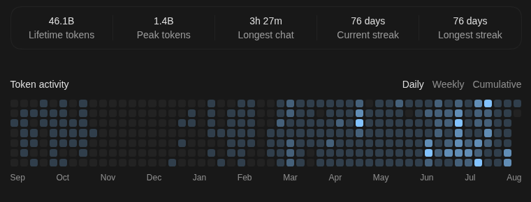

  <h1>Hi, I'm Kevin Hagy</h1>
  

  <strong>Currently at <a href="https://www.fronteraspace.com/">Frontera Space</a></strong> 
  

## Technologies I work with

## GitHub snapshot

  
  

## Token Usage

  

  

